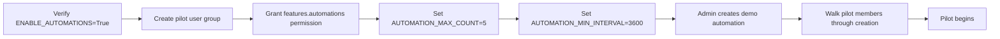

# Automations Feature — Pilot Plan

**Audience:** AI Advisory Group (5–8 people) · **Environment:** Preprod · **Duration:** 2 weeks

---

## 1. Feature Overview

Automations let users schedule recurring AI prompts that execute automatically on a cron-like schedule. Each automation creates a real chat conversation, so results are browsable and searchable like any other chat.

| Capability | Details |
|---|---|
| **Scheduling** | RRULE-based recurrence (minutely, hourly, daily, weekly, monthly, custom) |
| **Execution** | Backend scheduler polls every 10s, claims due automations, runs them through the full chat completion pipeline |
| **Model selection** | Any model the user has access to; inherits model's tools, features (web search, image gen), and filters |
| **Prompt templates** | Supports `{{CURRENT_DATETIME}}`, `{{CURRENT_DATE}}`, `{{CURRENT_TIME}}`, `{{USER_NAME}}`, `{{USER_LOCATION}}` variables |
| **Run history** | Each execution is logged with status (success/error), linked chat, and timestamp |
| **Calendar integration** | Active automations appear as events on the Calendar view; past runs show as completed events |
| **Manual trigger** | Users can "Run Now" to test without waiting for the schedule |
| **Toggle on/off** | Automations can be paused and resumed without deletion |
| **Terminal support** | Can optionally connect to a terminal server for code execution during the automation |

### Key Config

| Setting | Default | Notes |
|---|---|---|
| `ENABLE_AUTOMATIONS` | `True` | Already enabled by default |
| `AUTOMATION_MAX_COUNT` | empty (unlimited) | Max automations per non-admin user |
| `AUTOMATION_MIN_INTERVAL` | empty (no minimum) | Min seconds between recurrences for non-admins |
| `SCHEDULER_POLL_INTERVAL` | `10` seconds | How often the background worker checks for due automations |
| Group permission `features.automations` | `false` | Must be explicitly granted to non-admin groups |

---

## 2. Proposed Use Cases to Test

### UC-1: Daily Research Briefing

**What:** An automation that runs every weekday morning and asks an AI model to summarize recent developments in a specific topic area (e.g., "AI in higher education", "LLM safety research").

**Prompt example:**
```
Summarize the most important AI developments in higher education from the past 24 hours.
Focus on: new tools, policy changes, research papers, and institutional announcements.
Format as bullet points with source references where possible.
Today is {{CURRENT_DATE}}.
```

**Tests:**
- Does the automation fire reliably at the scheduled time?
- Is the AI output useful without human context/follow-up?
- Does enabling web search on the model improve results?
- Can users find and read past automation outputs easily?
- How do automation-generated chats appear in the chat list?

### UC-2: Weekly Meeting Prep

**What:** An automation that runs every Monday morning to generate a structured agenda or discussion prompts for a recurring team meeting.

**Prompt example:**
```
Generate 3-5 discussion topics for this week's AI Advisory Group meeting.
Consider current trends in AI adoption at universities, recent Dartmouth Chat usage patterns,
and any emerging concerns about AI in education. Today is {{CURRENT_DATE}}.
Format as a numbered list with a brief description for each topic.
```

**Tests:**
- Is the weekly scheduling intuitive to set up?
- Can the output be easily shared with the group (e.g., copy-paste, or reference in a Channel)?
- Does the "Run Now" button work for testing before the scheduled time?

### UC-3: Compliance/Policy Check

**What:** A monthly automation that asks the AI to review a set of guidelines or policies and flag anything that may need updating.

**Prompt example:**
```
Review the following AI usage guidelines for Dartmouth and identify any sections that may
need updating based on current best practices and recent regulatory changes:
[paste or reference guidelines]
Flag specific sections and explain why they may need revision. Today is {{CURRENT_DATE}}.
```

**Tests:**
- Is monthly scheduling correctly handled?
- How does the AI perform on longer, more analytical prompts?
- Is there a way to attach reference documents to the automation? (Limitation: currently prompt-only)

### UC-4: Personal Productivity Assistant

**What:** Each pilot member creates their own automation for a personal use case (e.g., daily task planning, end-of-day reflection prompts, weekly reading list generation).

**Tests:**
- Can non-admin users create and manage their own automations?
- Is the RRULE schedule picker intuitive?
- Do users understand the relationship between automations and the resulting chats?
- What creative use cases emerge organically?

---

## 3. Staging Environment Setup



### Setup Checklist

- [ ] Verify `ENABLE_AUTOMATIONS=True` in staging config (should be default)
- [ ] Create or reuse the **AI Advisory Pilot** user group
- [ ] Grant `features.automations` permission to the pilot group
- [ ] Set `AUTOMATION_MAX_COUNT=5` to prevent runaway creation during pilot
- [ ] Set `AUTOMATION_MIN_INTERVAL=3600` (1 hour minimum) to control credit spend
- [ ] Verify the scheduler worker is running (`Scheduler worker started` in logs)
- [ ] Admin creates a demo automation (UC-1: Daily Research Briefing) to verify end-to-end flow before inviting pilot members
- [ ] Verify at least one model with web search capability is available (improves UC-1 results)
- [ ] Prepare a short guide for pilot members explaining how to create their first automation

---

## 4. Evaluation Criteria

| Dimension | Questions to Answer |
|---|---|
| **Usefulness** | Which use cases delivered genuinely useful outputs? Which felt like novelty? |
| **Reliability** | Did automations fire on schedule? Any missed runs or errors? Check run history. |
| **Output quality** | Were AI responses actionable without follow-up, or did they need refinement? |
| **Discoverability** | Could users find automation results in their chat list? Was the Calendar integration helpful? |
| **UX clarity** | Is the schedule picker intuitive? Do users understand RRULE concepts (or is the UI abstraction sufficient)? |
| **Credit impact** | How many credits did automations consume over 2 weeks? Project this to campus-wide usage. |
| **Prompt crafting** | Did users struggle to write effective automation prompts? Is guidance/templates needed? |
| **Governance** | What controls do admins need? (max count, min interval, ability to view/disable user automations) |
| **Noise factor** | Did automation-generated chats clutter the chat list? Is a separate view needed? |

### Feedback Collection

- Mid-pilot check-in (end of week 1): quick survey on setup experience and early impressions
- Final survey + group discussion (end of week 2): detailed feedback on each use case
- Encourage pilot members to keep a brief log of which automations they found useful vs. ignored

---

## 5. Known Limitations & Risks

| Issue | Impact | Mitigation |
|---|---|---|
| **Prompt-only input** — automations cannot attach files or reference knowledge bases | Limits use cases that need document context (UC-3) | Workaround: paste key content into the prompt; note as enhancement request |
| **No conditional logic** — automations always run on schedule regardless of conditions | Cannot skip runs based on external triggers or "nothing new" scenarios | Accept for pilot; note for future enhancement |
| **Chat list clutter** — each run creates a new chat | Frequent automations (daily) generate many chats | Set `AUTOMATION_MIN_INTERVAL=3600`; advise users to use folders to organize automation chats |
| **No output routing** — results go to chat only, not to email/channel/webhook | Users must check Dartmouth Chat to see results | Note as rollout consideration; integration with Channels could help |
| **Code interpreter unavailable** — automations cannot use code interpreter (requires frontend event emitter) | Limits data analysis use cases | Document; backend-only execution is a known constraint |
| **Single-turn only** — each automation run is a single prompt/response, no multi-turn conversation | Cannot build on previous automation outputs | Advise users to make prompts self-contained |
| **Timezone handling** — schedule uses user's timezone from profile | Incorrect timezone = wrong execution time | Verify pilot members have correct timezone in their profiles |
| **Credit consumption** — each run uses credits like a normal chat | Daily automations across many users could be expensive | `AUTOMATION_MIN_INTERVAL` + `AUTOMATION_MAX_COUNT` as guardrails; monitor during pilot |
| **Admin visibility** — admins cannot currently see or manage other users' automations | Hard to audit or disable runaway automations | Admin can query the database directly; note as rollout blocker |

---

## 6. Rollout Considerations (to validate during pilot)

- **Default off for non-admins:** The `features.automations` permission defaults to `false` — this is appropriate; enable per-group as needed
- **Credit budgeting:** Should automations have a separate credit budget, or share the user's existing allocation?
- **Prompt templates/library:** Would a shared library of automation prompt templates help adoption?
- **Output delivery:** Should automation results be pushable to Channels, email, or webhooks?
- **Audit trail:** Do admins need a dashboard showing all active automations across users?
- **Folder auto-organization:** Should automation-generated chats auto-sort into a dedicated folder?
- **Rate limiting at scale:** With 1,000+ users, what `AUTOMATION_MAX_COUNT` and `AUTOMATION_MIN_INTERVAL` values are sustainable?
- **Scheduler scaling:** The worker runs on every instance — at scale, does the `claim_due` mechanism prevent duplicate execution reliably?
