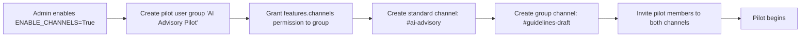

# Channels Feature — Pilot Plan

**Audience:** AI Advisory Group (5–8 people) · **Environment:** Preprod · **Duration:** 2 weeks

---

## 1. Feature Overview

Channels is a Slack-like real-time messaging layer built into Dartmouth Chat. It supports:

| Capability | Details |
|---|---|
| **Channel types** | `standard` (visible to all permitted users), `group` (invite-only), `dm` (1-on-1 direct messages) |
| **Threads** | Reply threads on any message |
| **@mentions** | Mention users, models, or other channels |
| **AI model responses** | Mention a model (e.g. `@gpt-4o`) in a channel message and it replies inline |
| **Pinned messages** | Pin important messages for quick reference |
| **Webhooks** | Inbound webhooks to post messages from external systems |
| **File sharing** | Upload and attach files to channel messages |
| **Reactions** | Emoji reactions on messages |
| **Unread tracking** | Per-user read cursors and unread counts |
| **Access control** | ACL-based read/write grants per channel (groups and individual users) |
| **Permissions** | Global toggle (`ENABLE_CHANNELS`) + per-group permission (`features.channels`) |

### Key Config

| Setting | Default | Notes |
|---|---|---|
| `ENABLE_CHANNELS` | `False` | Must be flipped to `True` to activate |
| Group permission `features.channels` | `true` | Can restrict to specific user groups |
| `sharing.public_channels` | — | Controls whether non-admins can create public channels |

---

## 2. Proposed Use Cases to Test

### UC-1: AI Advisory Discussion Channel (standard channel)

**What:** A shared channel where advisory group members discuss AI topics, share links, and ask questions — with AI models available as participants.

**Tests:**
- Can members @ mention an AI model and get a useful inline response?
- Is the threaded reply UX intuitive for follow-up questions to the AI?
- How does the AI response quality compare to a regular 1-on-1 chat?
- Do notifications (unread counts, webhook alerts) work reliably?

### UC-2: Group Project Channel (group channel, invite-only)

**What:** A private channel for a subset of the advisory group to collaborate on a specific deliverable (e.g., drafting AI usage guidelines).

**Tests:**
- Is the invite/member-management flow clear?
- Can members share files and reference them in conversation?
- Is the pinned-messages feature useful for tracking decisions?
- How does access control behave when a non-member tries to access the channel?

### UC-3: Direct Messages with AI Context

**What:** Pilot members use DMs to have 1-on-1 conversations, testing whether the DM experience adds value beyond existing chat.

**Tests:**
- Is the DM creation flow discoverable?
- Does the presence/status indicator work?
- Is there a clear mental model for when to use DM vs. regular chat?

### UC-4: Webhook Integration (stretch goal)

**What:** Set up a webhook to post automated updates into a channel (e.g., a daily digest from an RSS feed or a GitHub notification).

**Tests:**
- Is the webhook creation UX accessible to non-technical admins?
- Do webhook messages render well alongside human messages?
- Is the webhook URL/token management secure enough for production?

---

## 3. Staging Environment Setup

### Setup Checklist

- [ ] Set `ENABLE_CHANNELS=True` in staging environment config
- [ ] Create a user group named **AI Advisory Pilot** containing the 5–8 pilot participants
- [ ] Grant `features.channels` permission to that group (deny for all other groups to limit blast radius)
- [ ] Admin creates the standard channel `#ai-advisory` with read/write access granted to the pilot group
- [ ] Admin creates the group channel `#guidelines-draft` and invites a subset of members
- [ ] Verify at least one AI model is available for @mention in channels (model must be in the user's model list)
- [ ] (Optional) Create a test webhook on `#ai-advisory` to verify inbound integration

---

## 4. Evaluation Criteria

| Dimension | Questions to Answer |
|---|---|
| **Usefulness** | Does the channel paradigm add value vs. separate 1-on-1 chats? Which use cases resonated most? |
| **AI-in-channel quality** | Are inline AI responses useful, or do users prefer dedicated chat? Is the thread-scoped context adequate (AI only sees the thread it is mentioned in, not the full channel)? |
| **UX clarity** | Is the distinction between standard/group/DM channels intuitive? Can users find and manage channels without training? |
| **Notification reliability** | Do unread counts update correctly? Are webhook notifications delivered? |
| **Performance** | Any noticeable lag in message delivery or AI response in channels? |
| **Access control** | Does the permission model work as expected? Any confusion about who can see what? |
| **Moderation** | What moderation tools are missing? (e.g., message deletion by admins, muting users) |
| **Rollout readiness** | What group/permission structure would work for a campus-wide rollout? |

### Feedback Collection

- Final survey at end of week 2 (questions below)
- Participants can reach out anytime during the pilot if they need help or want to flag issues
- Encourage pilot members to note friction points in a pinned thread in `#ai-advisory`

### Final Survey Questions

#### Overall Experience

1. **How often did you use Channels during the pilot?**
   - Daily / A few times a week / Once or twice / Never after onboarding

2. **How would you rate Channels overall?**
   - ⭐ 1–5 scale (1 = not useful, 5 = very useful)

3. **Would you recommend enabling Channels for your broader team?**
   - Yes / Maybe with changes / No

#### Usefulness

4. **Which channel types did you find most useful?** (select all that apply)
   - Standard channels (e.g., #rcd-leadership)
   - Group channels (invite-only)
   - Direct messages
   - None of them

5. **What did you primarily use Channels for?** (select all that apply)
   - Team discussion / coordination
   - Asking AI models questions in a group setting
   - Sharing files or links
   - Quick 1-on-1 messages (DMs)
   - Other: ___

6. **Compared to Slack/Teams, how does Channels fit into your workflow?**
   - Replaces some Slack/Teams use / Complements it / Redundant / Not comparable

#### AI in Channels

7. **Did you use the AI @mention feature (e.g., @gpt-4o) in a channel?**
   - Yes, frequently / Yes, a few times / No

8. **If yes: How useful were inline AI responses in a group channel context?**
   - ⭐ 1–5 scale (1 = not useful, 5 = very useful)

9. **Did the AI have enough context to give good answers in the channel?**
   - Yes, usually / Sometimes / Rarely / Did not try

10. **Would you prefer AI responses in channels vs. a separate 1-on-1 chat?**
    - Prefer in-channel / Prefer separate chat / Depends on the situation / No preference

#### UX and Discoverability

11. **Was the difference between standard channels, group channels, and DMs clear?**
    - Yes / Somewhat / No

12. **Were you able to create a group channel or DM without help?**
    - Yes / Needed help / Did not try

13. **Was any feature hard to find or confusing?**
    - Free text: ___

#### What is Missing

14. **What features or improvements would make Channels more useful for your team?** (select all that apply)
    - Better notifications (e.g., push, email digest)
    - Search across channel messages
    - Channel archiving (instead of delete)
    - Message edit history
    - Ability for non-admins to create standard channels
    - Threading improvements
    - Other: ___

15. **Any other feedback, concerns, or suggestions?**
    - Free text: ___

---

## 5. Known Limitations & Risks

| Issue | Impact | Mitigation |
|---|---|---|
| **AI context scope in channels** — the model only sees the thread it is mentioned in (up to 50 messages), not the rest of the channel | AI responses lack context from other threads or top-level channel messages | Document this limitation; advise users to include context in their @mention |
| **No message edit history** — edited messages don't show revision history | Users can silently change what they said | Note for rollout: consider whether edit history is needed |
| **Channel creation permissions** — only admins can create standard channels; non-admins can create group/DM | Advisory group members cannot self-organize standard channels | Admin pre-creates channels or grants `sharing.public_channels` permission |
| **No channel archiving** — channels can only be deleted, not archived | Completed project channels lose their history on deletion | Advise: do not delete channels during pilot; archive feature may need to be built |
| **Webhook security** — webhook URLs contain a token in the path | URL leakage = unauthorized posting | Restrict webhook creation to admins; rotate tokens if compromised |
| **Credit usage** — AI responses in channels consume credits like regular chats | Could accelerate credit consumption | Monitor credit usage during pilot |

---

## 6. Rollout Considerations (to validate during pilot)

- **Naming conventions:** Should Dartmouth enforce channel naming standards (e.g., `#dept-topic`)?
- **Default channels:** Should new users auto-join certain channels (e.g., `#announcements`)?
- **Channel sprawl:** What governance prevents creation of too many channels?
- **Data retention:** Do channel messages fall under the same retention policy as chats?
- **FERPA/privacy:** Are channel conversations subject to the same data handling as regular chats?
- **Scale:** How does real-time messaging perform with 100+ concurrent channel users?
