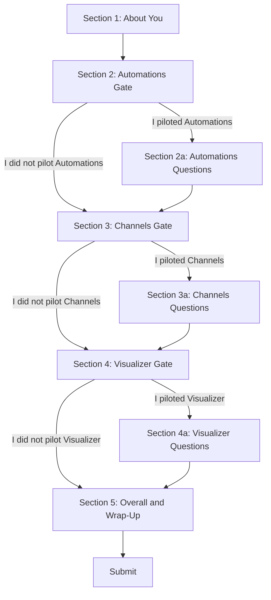

# Dartmouth Chat Pilot Exit Survey — Google Form Spec

A single Google Form covering all three pilots (Automations, Channels, Visualizer). Respondents self-identify which features they piloted and are routed to only the relevant sections via Google Forms section branching.

---

## Form Structure Overview

### Google Forms Branching Setup

Each gate section contains a single Yes/No question. Configure:
- **Yes** → Go to the feature questions section
- **No** → Skip to the next gate section (or wrap-up if last)

Each feature questions section ends with "After this section → Go to next gate section."

---

## Section 1: About You

> **Section description:** Thank you for participating in the Dartmouth Chat pilot program! This survey covers the Automations, Channels, and Visualizer features. You will only see questions for the features you piloted. The survey should take about 5–10 minutes.

**Q1.1** — Name
- Type: Short text
- Required: Yes

**Q1.2** — Department or group
- Type: Dropdown
  - AI Advisory Group
  - Research Computing and Data (RCD)
  - Dartmouth Center for the Advancement of Learning (DCAL)
  - Dartmouth Library
  - Other: ___

**Q1.3** — How long have you been using Dartmouth Chat (before the pilot)?
- Type: Multiple choice
  - Less than a month
  - 1–3 months
  - 3–6 months
  - More than 6 months

---

## Section 2: Automations Gate

**Q2.0** — Did you participate in the Automations pilot?
- Type: Multiple choice
  - Yes → Go to Section 2a
  - No → Go to Section 3

---

## Section 2a: Automations Questions

> **Section description:** These questions are about your experience with Automations — scheduled, recurring AI prompts that run automatically.

**Q2.1** — How useful is Automations for your work at Dartmouth?
- Type: Linear scale 1–5
  - 1 = Not useful at all
  - 5 = Extremely useful

**Q2.2** — Were the AI responses from your automations useful without follow-up?
- Type: Linear scale 1–5
  - 1 = Never useful
  - 5 = Always useful

**Q2.3** — Did your automations fire reliably on schedule?
- Type: Multiple choice
  - Yes, every time
  - Mostly, with a few missed runs
  - Unreliable — many missed runs
  - I did not check closely

**Q2.4** — What was the single best use case you discovered for Automations?
- Type: Long text

**Q2.5** — What improvements would make Automations more useful? (select all that apply)
- Type: Checkboxes
  - Output delivery (email, channel post, webhook)
  - File/document attachments in prompts
  - Multi-turn conversations (build on previous runs)
  - Conditional execution (skip if nothing new)
  - Shared/team automations
  - Prompt templates or a shared library
  - Separate folder for automation chats
  - Better admin visibility and management
  - Other: ___

> **After this section:** Go to Section 3

---

## Section 3: Channels Gate

**Q3.0** — Did you participate in the Channels pilot?
- Type: Multiple choice
  - Yes → Go to Section 3a
  - No → Go to Section 4

---

## Section 3a: Channels Questions

> **Section description:** These questions are about your experience with Channels — real-time group messaging with AI model integration built into Dartmouth Chat.

**Q3.1** — How useful is Channels for your work at Dartmouth?
- Type: Linear scale 1–5
  - 1 = Not useful at all
  - 5 = Extremely useful

**Q3.2** — How useful were inline AI responses when you @mentioned a model in a channel?
- Type: Linear scale 1–5
  - 1 = Not useful at all
  - 5 = Extremely useful
  - N/A — I did not try this

**Q3.3** — Compared to Slack/Teams, how does Channels fit into your workflow?
- Type: Multiple choice
  - Replaces some Slack/Teams use
  - Complements Slack/Teams
  - Redundant with Slack/Teams
  - Not comparable — serves a different purpose

**Q3.4** — What was the single best use case you discovered for Channels?
- Type: Long text

**Q3.5** — What improvements would make Channels more useful? (select all that apply)
- Type: Checkboxes
  - Better notifications (push, email digest)
  - Search across channel messages
  - Channel archiving (instead of delete)
  - Message edit history
  - Ability for non-admins to create standard channels
  - Threading improvements
  - Per-channel notification controls
  - Other: ___

> **After this section:** Go to Section 4

---

## Section 4: Visualizer Gate

**Q4.0** — Did you participate in the Visualizer pilot?
- Type: Multiple choice
  - Yes → Go to Section 4a
  - No → Go to Section 5

---

## Section 4a: Visualizer Questions

> **Section description:** These questions are about your experience with the Visualizer tool — inline interactive visualizations (charts, diagrams, dashboards, widgets) rendered directly in the chat window.

**Q4.1** — How useful is the Visualizer tool for your work at Dartmouth?
- Type: Linear scale 1–5
  - 1 = Not useful at all
  - 5 = Extremely useful

**Q4.2** — How often did visualizations render correctly on the first try?
- Type: Multiple choice
  - Always
  - Usually
  - Sometimes
  - Rarely

**Q4.3** — How intuitive was the Visualizer to use without training?
- Type: Linear scale 1–5
  - 1 = Very confusing
  - 5 = Very intuitive

**Q4.4** — What was the single best use case you discovered for the Visualizer?
- Type: Long text

**Q4.5** — What improvements or concerns do you have about the Visualizer? (e.g., missing features, reliability, accessibility, rollout concerns)
- Type: Long text

> **After this section:** Go to Section 5

---

## Section 5: Overall and Wrap-Up

> **Section description:** A few final questions about your overall Dartmouth Chat experience and the pilot program.

**Q5.1** — How satisfied are you with Dartmouth Chat overall?
- Type: Linear scale 1–5
  - 1 = Very dissatisfied
  - 5 = Very satisfied

**Q5.2** — If you piloted multiple features, which was the most valuable to you?
- Type: Multiple choice
  - Automations
  - Channels
  - Visualizer
  - I only piloted one feature
  - None stood out

**Q5.3** — Was the Workspace Model concept (creating a model with tools pre-configured) clear and manageable?
- Type: Multiple choice
  - Yes, straightforward
  - Took some effort but I got it
  - Confusing — needs better explanation or UX
  - I did not create a Workspace Model

**Q5.4** — Was two weeks enough time to properly evaluate the feature(s) you piloted?
- Type: Multiple choice
  - Yes, plenty of time
  - About right
  - Could have used another week
  - Not enough time

**Q5.5** — Is there anything else you would like to share about Dartmouth Chat, the features you tested, or the pilot program?
- Type: Long text

---

## Question Summary

| Section | Questions | Estimated Time |
|---------|-----------|---------------|
| Section 1: About You | 3 | 1 min |
| Section 2a: Automations | 5 | 2–3 min |
| Section 3a: Channels | 5 | 2–3 min |
| Section 4a: Visualizer | 5 | 2–3 min |
| Section 5: Wrap-Up | 5 | 2 min |
| **Total if all three** | **23 + 3 gates** | **~10 min** |
| **Total if one feature** | **~13 + 1 gate** | **~5 min** |

---

## Google Forms Implementation Notes

1. **Create 9 sections** in Google Forms: Section 1, Section 2 (gate), Section 2a, Section 3 (gate), Section 3a, Section 4 (gate), Section 4a, Section 5
2. **Gate sections** contain only one Yes/No question with "Go to section based on answer" branching
3. **Feature sections** end with "After section X → Go to [next gate section]"
4. **Collect email addresses** is optional since Q1.1 captures name — but enabling it provides verification
5. **Allow response editing** — let participants come back and update answers
6. **Confirmation message:** "Thank you for your feedback! Your input will directly shape the rollout of these features across Dartmouth."
