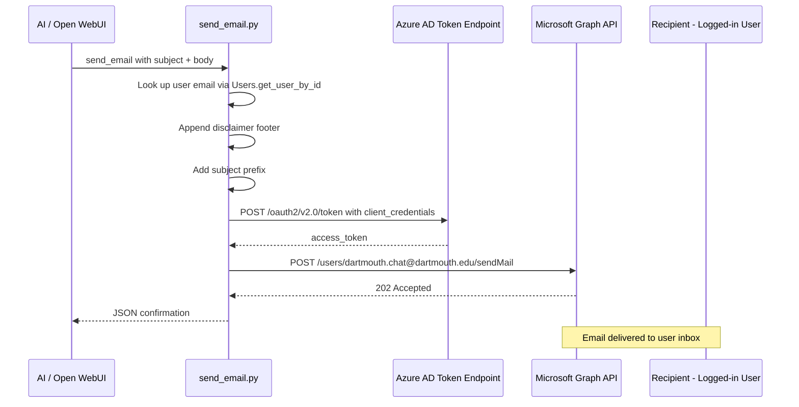

# Send Email Tool — Implementation Plan

## Overview

Create a new Open WebUI tool (`send_email.py`) that allows the AI to send emails via Microsoft Graph API using a dedicated Dartmouth service account (`dartmouth.chat@dartmouth.edu`).

## Architecture



## Key Decisions

### Authentication
- **Client Credentials flow** (app-only, no interactive sign-in)
- Requires Azure AD app registration with:
  - `tenant_id`
  - `client_id`
  - `client_secret`
  - **Mail.Send** application permission (admin-consented)
- Token fetched fresh on each send (no caching for v1)

### Recipient Restrictions
- **Locked to the logged-in user only** — the tool resolves the recipient email from `Users.get_user_by_id(__user__[id]).email`
- The AI cannot specify an arbitrary recipient
- No CC/BCC support

### Email Content
- **Body format**: Both plain text and HTML supported (AI chooses via a `body_type` parameter: `text` or `html`)
- **Subject prefix**: Configurable via Valve, defaults to `[Dartmouth Chat] `
- **Disclaimer footer**: Always appended — "This email was sent by Dartmouth Chat on behalf of {user_name}."
  - For HTML emails, the footer is wrapped in a styled `<p>` tag
  - For text emails, the footer is separated by a blank line

### Sender
- Always `dartmouth.chat@dartmouth.edu` (hardcoded in Valve default, configurable by admin)

### Dependencies
- **httpx** for async HTTP calls (already available in the environment as a transitive dependency of Open WebUI; will be added explicitly to `pyproject.toml`)
- No Microsoft SDK dependencies needed

### Return Format
- Success: `{"status": "sent", "to": "user@dartmouth.edu", "subject": "[Dartmouth Chat] ..."}`
- Error: `{"error": "descriptive message"}`

## File Structure

### New file: `src/dartmouth_chat_tools/send_email.py`

```python
class Tools:
    class Valves(BaseModel):
        tenant_id: str = Field(default="", description="Azure AD tenant ID")
        client_id: str = Field(default="", description="Azure AD app client ID")
        client_secret: str = Field(default="", description="Azure AD app client secret")
        sender_email: str = Field(
            default="dartmouth.chat@dartmouth.edu",
            description="Email address to send from"
        )
        subject_prefix: str = Field(
            default="[Dartmouth Chat] ",
            description="Prefix added to all email subjects"
        )

    def __init__(self):
        self.valves = self.Valves()

    async def send_email(
        self,
        subject: str,
        body: str,
        body_type: Literal["text", "html"] = "text",
        __user__: dict = None,
    ) -> str:
        ...
```

### Key implementation details:
1. Resolve user email: `user = await Users.get_user_by_id(__user__["id"])` → `user.email`
2. Append disclaimer footer to body
3. Prepend subject prefix
4. Acquire token: `POST https://login.microsoftonline.com/{tenant_id}/oauth2/v2.0/token`
5. Send email: `POST https://graph.microsoft.com/v1.0/users/{sender_email}/sendMail`
6. Return JSON result

### Modified file: `pyproject.toml`
- Add `httpx` to dependencies

## Azure AD Setup Prerequisites

Before the tool can work, an admin must:

1. **Create an App Registration** in Azure AD (Entra ID)
   - Name: e.g., "Dartmouth Chat Email Sender"
   - No redirect URI needed (daemon app)
2. **Add API Permission**: Microsoft Graph → Application permissions → `Mail.Send`
3. **Grant Admin Consent** for the `Mail.Send` permission
4. **Create a Client Secret** under Certificates & Secrets
5. **Record** the `tenant_id`, `client_id`, and `client_secret`
6. **Configure Valves** in Open WebUI with these three values

> **Note**: The `Mail.Send` application permission allows sending as ANY user in the tenant. To restrict this, an Exchange admin can configure an **Application Access Policy** that limits the app to only send as `dartmouth.chat@dartmouth.edu`. This is strongly recommended.
